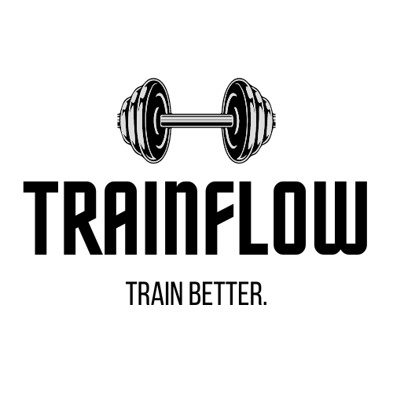

<p align="center">
  
</p>


## Description

The TrainFlow application API.

## Development setup

Configure the development tools:

```bash
# install pnpm
$ npm i -g pnpm@7

# install the required dependencies
$ pnpm i
```

## Docker setup

This project requires Docker and Docker compose.

All of the necessary configuration is done via the `.env` file. Copy the `.env.example` file to `.env` and set the necessary variables.

The application expects both the two PostgreSQL and Redis database containers to be up and running.

```bash
# start the docker containers
$ docker compose up -d --build
```

## Running the app

```bash
# development
$ pnpm run start

# watch mode
$ pnpm run start:dev

# production mode
$ pnpm run start:prod
```

## Test

```bash
# run tests
$ pnpm run test

# test coverage
$ pnpm run test:cov
```

<!-- 

TODO: choose a license and add relevant information 

## License

Nest is [MIT licensed](LICENSE). 
-->
